# Phonoglyph Codebase Dependency Map

## Overview

This document provides a comprehensive analysis of the Phonoglyph codebase dependencies, focusing on the audio processing pipeline, visualization rendering system, data flow architecture, and UI state management.

## Architecture Summary

Phonoglyph is a full-stack MIDI visualization platform built with:
- **Frontend**: Next.js 14.1.0 + TypeScript + Three.js + tRPC
- **Backend**: Express.js + tRPC + PostgreSQL + Supabase
- **Audio Processing**: Spleeter (Docker) + FFmpeg + Web Audio API
- **Storage**: Cloudflare R2 + Supabase Storage
- **Visualization**: Three.js + WebGL + Custom Shaders

## High-Level Architecture Diagram

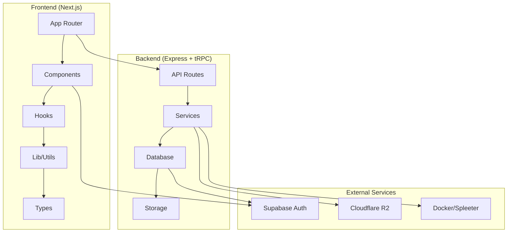

## 1. Frontend Dependencies

### 1.1 App Directory (`/apps/web/src/app/`)

#### File List
- `layout.tsx` - Root layout with providers
- `page.tsx` - Home page with auth state
- `creative-visualizer/page.tsx` - Main visualization interface
- `audio-analysis-sandbox/page.tsx` - Audio analysis testing
- `dashboard/page.tsx` - User dashboard
- `files/page.tsx` - File management
- `profile/page.tsx` - User profile
- `(auth)/login/page.tsx` - Login page
- `(auth)/signup/page.tsx` - Signup page

#### Import Graph
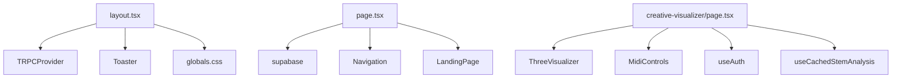

#### Export Graph
- `layout.tsx` exports: `RootLayout` component
- `page.tsx` exports: `HomePage` component
- `creative-visualizer/page.tsx` exports: `CreativeVisualizerPage` component

#### Dependency Chains
```
page.tsx → Navigation → useAuth → AuthService → supabase
page.tsx → LandingPage → useAuth → AuthService → supabase
creative-visualizer → ThreeVisualizer → VisualizerManager → Three.js
```

### 1.2 Components Directory (`/apps/web/src/components/`)

#### File List
- **Audio Analysis**: `analysis-comparison.tsx`, `analysis-parameters.tsx`, `analysis-visualization.tsx`
- **Auth**: `auth-guard.tsx`, `login-form.tsx`, `signup-form.tsx`, `profile-menu.tsx`
- **MIDI**: `file-selector.tsx`, `midi-controls.tsx`, `midi-timeline.tsx`, `three-visualizer.tsx`
- **UI**: `button.tsx`, `card.tsx`, `input.tsx`, `slider.tsx`, etc.
- **Providers**: `trpc-provider.tsx`

#### Import Graph
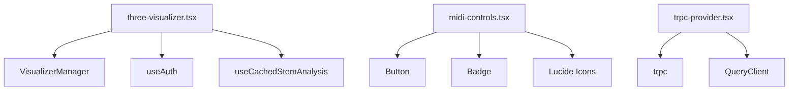

#### Export Graph
- `three-visualizer.tsx` exports: `ThreeVisualizer` component
- `midi-controls.tsx` exports: `MidiControls` component
- `trpc-provider.tsx` exports: `TRPCProvider` component

#### Dependency Chains
```
ThreeVisualizer → VisualizerManager → Three.js → WebGL
MidiControls → Button → UI Components → Tailwind CSS
TRPCProvider → trpc → tRPC Client → API
```

### 1.3 Hooks Directory (`/apps/web/src/hooks/`)

#### File List
- `use-auth.ts` - Authentication state management
- `use-audio-analysis.ts` - Audio analysis data
- `use-cached-stem-analysis.ts` - Cached stem analysis
- `use-stem-audio-controller.ts` - Stem audio playback
- `use-auto-save.ts` - Auto-save functionality
- `use-upload.ts` - File upload management

#### Import Graph
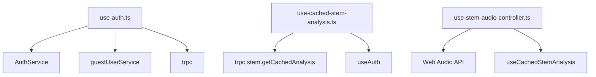

#### Export Graph
- `use-auth.ts` exports: `useAuth` hook
- `use-cached-stem-analysis.ts` exports: `useCachedStemAnalysis` hook
- `use-stem-audio-controller.ts` exports: `useStemAudioController` hook

#### Dependency Chains
```
useAuth → AuthService → supabase → Supabase Auth
useCachedStemAnalysis → trpc → API → Database
useStemAudioController → Web Audio API → AudioContext
```

### 1.4 Lib Directory (`/apps/web/src/lib/`)

#### File List
- `auth.ts` - Authentication service
- `supabase.ts` - Supabase client configuration
- `trpc.ts` - tRPC client setup
- `trpc-links.ts` - tRPC link configuration
- `visualizer/` - Visualization utilities
- `video-composition/` - Video composition utilities

#### Import Graph
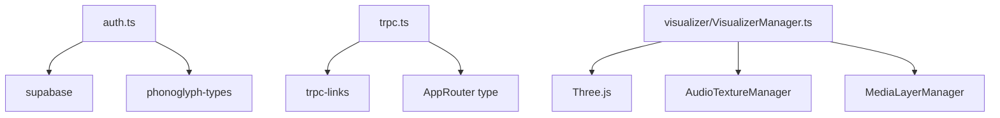

#### Export Graph
- `auth.ts` exports: `AuthService` class
- `supabase.ts` exports: `supabase` client
- `trpc.ts` exports: `trpc` client and `trpcClient`
- `visualizer/VisualizerManager.ts` exports: `VisualizerManager` class

#### Dependency Chains
```
AuthService → supabase → Supabase Auth API
trpc → trpc-links → HTTP → API Server
VisualizerManager → Three.js → WebGL → GPU
```

### 1.5 Types Directory (`/apps/web/src/types/`)

#### File List
- `audio-analysis.ts` - Audio analysis type definitions
- `midi.ts` - MIDI data type definitions
- `stem-audio-analysis.ts` - Stem analysis types
- `stem-visualization.ts` - Stem visualization types
- `video-composition.ts` - Video composition types
- `visualizer.ts` - Visualization effect types

#### Import Graph
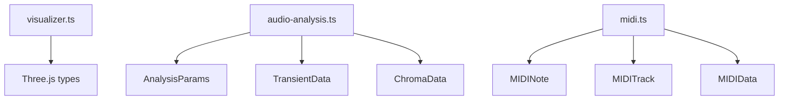

#### Export Graph
- `visualizer.ts` exports: `VisualEffect`, `AudioAnalysisData`, `LiveMIDIData`
- `audio-analysis.ts` exports: `AnalysisParams`, `TransientData`, `ChromaData`
- `midi.ts` exports: `MIDINote`, `MIDITrack`, `MIDIData`

## 2. Backend Dependencies

### 2.1 API Directory (`/apps/api/src/`)

#### File List
- `index.ts` - Express server setup
- `trpc.ts` - tRPC configuration
- `routers/` - API route handlers
- `services/` - Business logic services
- `db/` - Database connection and migrations
- `types/` - Backend type definitions

#### Import Graph
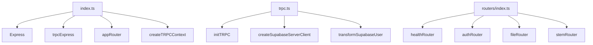

#### Export Graph
- `index.ts` exports: Express app
- `trpc.ts` exports: `createTRPCContext`, `router`, `protectedProcedure`
- `routers/index.ts` exports: `appRouter`

#### Dependency Chains
```
index.ts → trpcExpress → tRPC → API Routes
trpc.ts → createSupabaseServerClient → Supabase → Auth
routers → services → database → storage
```

### 2.2 Routers Directory (`/apps/api/src/routers/`)

#### File List
- `index.ts` - Router aggregation
- `auth.ts` - Authentication routes
- `file.ts` - File management routes
- `stem.ts` - Stem separation routes
- `midi.ts` - MIDI processing routes
- `project.ts` - Project management routes
- `user.ts` - User management routes

#### Import Graph
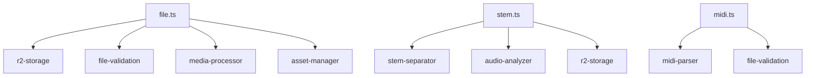

#### Export Graph
- `file.ts` exports: `fileRouter`
- `stem.ts` exports: `stemRouter`
- `midi.ts` exports: `midiRouter`

#### Dependency Chains
```
fileRouter → r2-storage → Cloudflare R2 → File Storage
stemRouter → stem-separator → Docker → Spleeter → Audio Processing
midiRouter → midi-parser → MIDI.js → MIDI Processing
```

### 2.3 Services Directory (`/apps/api/src/services/`)

#### File List
- `audio-analyzer.ts` - Audio analysis processing
- `stem-separator.ts` - Stem separation service
- `stem-processor.ts` - Stem processing utilities
- `r2-storage.ts` - Cloudflare R2 storage service
- `supabase-storage.ts` - Supabase storage service
- `media-processor.ts` - Media processing utilities
- `asset-manager.ts` - Asset management service

#### Import Graph
```mermaid
graph TD
    A[audio-analyzer.ts] --> B[fluent-ffmpeg]
    A --> C[wav]
    A --> D[supabase]
    A --> E[r2-storage]
    
    F[stem-separator.ts] --> G[Docker]
    F --> H[r2-storage]
    F --> I[audio-analyzer]
    
    J[r2-storage.ts] --> K[@aws-sdk/client-s3]
    J --> L[getSignedUrl]
```

#### Export Graph
- `audio-analyzer.ts` exports: `AudioAnalyzer` class
- `stem-separator.ts` exports: `StemSeparator` class
- `r2-storage.ts` exports: `r2Client`, `generateUploadUrl`, `generateDownloadUrl`

#### Dependency Chains
```
AudioAnalyzer → fluent-ffmpeg → FFmpeg → Audio Processing
StemSeparator → Docker → Spleeter → AI Audio Separation
R2Storage → AWS SDK → Cloudflare R2 → Object Storage
```

## 3. Audio Processing Pipeline

### 3.1 Pipeline Overview

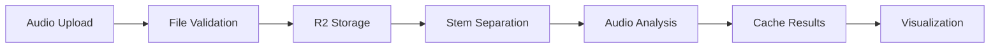

### 3.2 Key Dependencies

#### Frontend Audio Processing
- **Web Audio API**: Real-time audio analysis
- **Meyda**: Audio feature extraction
- **Audio Workers**: Background audio processing
- **Three.js Audio**: 3D audio visualization

#### Backend Audio Processing
- **Spleeter (Docker)**: AI-powered stem separation
- **FFmpeg**: Audio format conversion and processing
- **WAV Reader**: Audio file parsing
- **Custom FFT**: Frequency analysis

#### Dependency Chain
```
Audio Upload → File Validation → R2 Storage → Stem Separation → Audio Analysis → Cache → Visualization
```

## 4. Visualization Rendering System

### 4.1 Rendering Pipeline

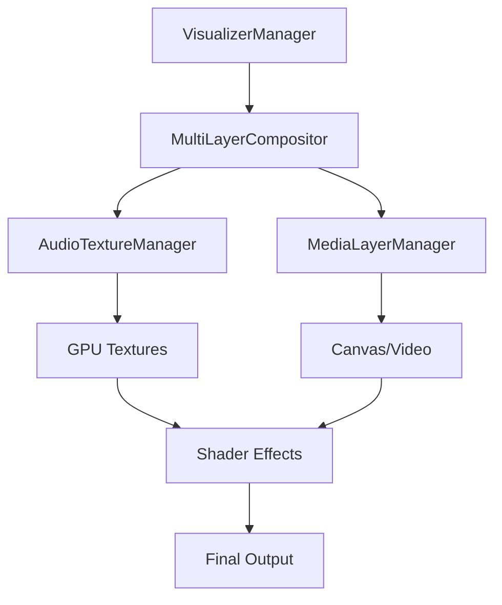

### 4.2 Key Dependencies

#### Core Rendering
- **Three.js**: 3D graphics framework
- **WebGL**: GPU rendering
- **Custom Shaders**: Audio-reactive effects
- **GPU Compositing**: Multi-layer rendering

#### Audio Integration
- **AudioTextureManager**: GPU audio data storage
- **Real-time Analysis**: Live audio feature extraction
- **Feature Mapping**: Audio-to-visual parameter mapping

#### Dependency Chain
```
Audio Data → AudioTextureManager → GPU Textures → Shader Effects → Visual Output
```

## 5. Data Flow Architecture

### 5.1 tRPC Data Flow

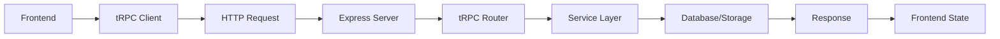

### 5.2 Authentication Flow

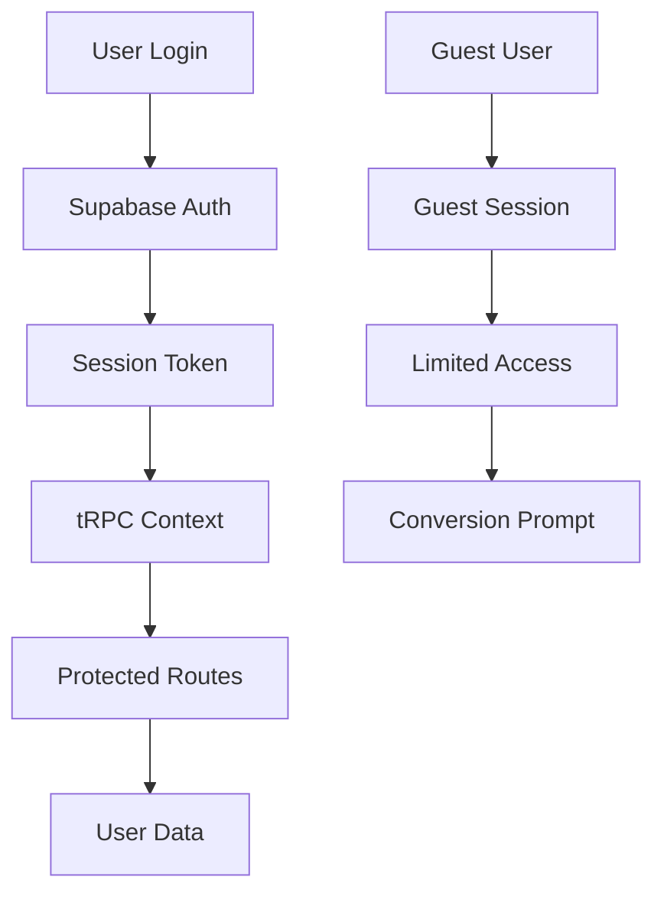

### 5.3 Caching Strategy

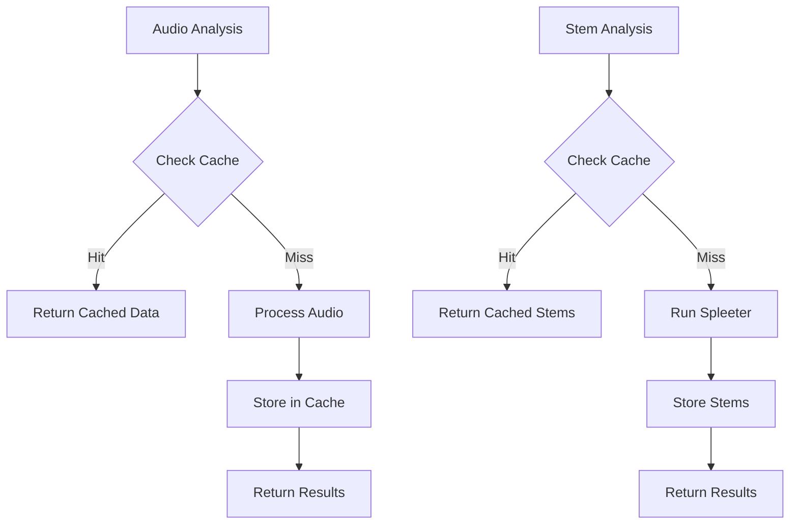

## 6. Critical Dependency Paths

### 6.1 Main Application Flow

```
1. User loads app → layout.tsx → TRPCProvider → trpc client
2. User authenticates → useAuth → AuthService → Supabase
3. User uploads audio → fileRouter → r2-storage → Cloudflare R2
4. Audio gets processed → stemRouter → stem-separator → Docker/Spleeter
5. Analysis cached → audio-analyzer → PostgreSQL → Supabase
6. Visualization renders → ThreeVisualizer → VisualizerManager → Three.js
```

### 6.2 Audio Processing Flow

```
1. Audio upload → file validation → R2 storage
2. Stem separation job → Docker container → Spleeter processing
3. Stem files → R2 storage → file metadata → database
4. Audio analysis → FFmpeg conversion → feature extraction → cache
5. Visualization → audio texture → GPU shaders → visual output
```

### 6.3 State Management Flow

```
1. Auth state → useAuth → AuthService → Supabase → global state
2. Audio data → useCachedStemAnalysis → tRPC → API → database
3. Visualization state → ThreeVisualizer → VisualizerManager → Three.js
4. UI state → React state → component props → re-renders
```

## 7. External Dependencies

### 7.1 Frontend Dependencies
- **Next.js 14.1.0**: React framework
- **TypeScript 5.3.3**: Type safety
- **Three.js**: 3D graphics
- **tRPC**: Type-safe API client
- **Supabase**: Authentication and database
- **Tailwind CSS**: Styling
- **Lucide React**: Icons

### 7.2 Backend Dependencies
- **Express.js 4.18.2**: Web server
- **tRPC**: API framework
- **PostgreSQL 16.1**: Database
- **Supabase**: Database and auth
- **Cloudflare R2**: Object storage
- **Docker**: Containerization
- **FFmpeg**: Audio processing

### 7.3 Development Dependencies
- **Vitest**: Testing framework
- **ESLint**: Code linting
- **Prettier**: Code formatting
- **pnpm**: Package manager

## 8. Performance Considerations

### 8.1 Frontend Performance
- **Code Splitting**: Next.js automatic code splitting
- **Image Optimization**: Next.js image optimization
- **Bundle Analysis**: Webpack bundle analyzer
- **GPU Acceleration**: WebGL for visualization

### 8.2 Backend Performance
- **Database Indexing**: Optimized queries
- **Caching**: Redis for session storage
- **CDN**: Cloudflare R2 for file delivery
- **Background Processing**: Queue workers for heavy tasks

### 8.3 Audio Processing Performance
- **Web Workers**: Background audio analysis
- **GPU Textures**: Efficient audio data storage
- **Streaming**: Progressive audio loading
- **Caching**: Pre-computed analysis results

## 9. Security Considerations

### 9.1 Authentication
- **Supabase Auth**: Secure authentication
- **JWT Tokens**: Secure session management
- **Guest Sessions**: Limited access for non-authenticated users
- **Rate Limiting**: Upload and API rate limits

### 9.2 File Security
- **File Validation**: MIME type and size validation
- **Executable Prevention**: Block executable files
- **Sanitization**: File name sanitization
- **Access Control**: User-based file access

### 9.3 API Security
- **tRPC Validation**: Input validation with Zod
- **CORS Configuration**: Proper CORS setup
- **Helmet**: Security headers
- **Error Handling**: Secure error responses

## 10. Deployment Architecture

### 10.1 Frontend Deployment
- **Vercel**: Next.js deployment platform
- **Environment Variables**: Secure configuration
- **Build Optimization**: Production builds
- **CDN**: Global content delivery

### 10.2 Backend Deployment
- **Express Server**: Node.js runtime
- **Database**: Supabase PostgreSQL
- **Storage**: Cloudflare R2
- **Docker**: Containerized services

### 10.3 Infrastructure
- **Monorepo**: pnpm workspaces
- **CI/CD**: GitHub Actions
- **Monitoring**: Error tracking and logging
- **Scaling**: Horizontal scaling capabilities

---

This dependency map provides a comprehensive overview of the Phonoglyph codebase architecture, highlighting the intricate relationships between components, services, and external dependencies that power this sophisticated MIDI visualization platform.
