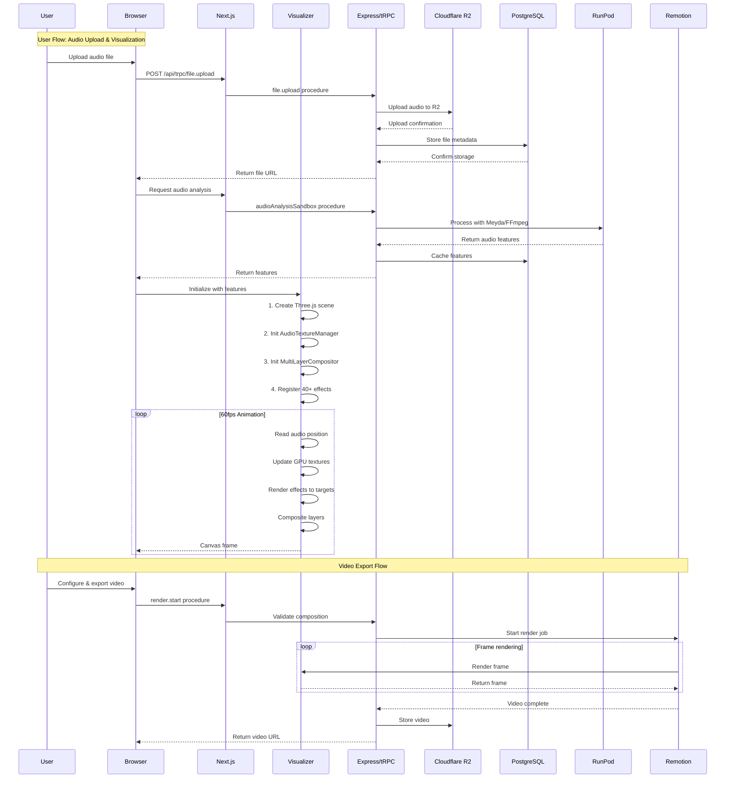
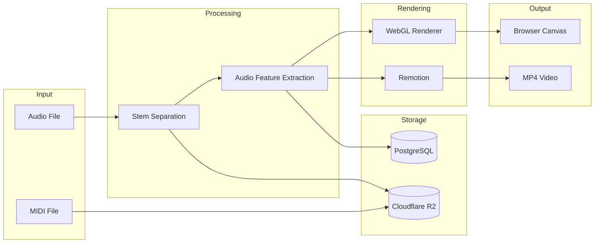
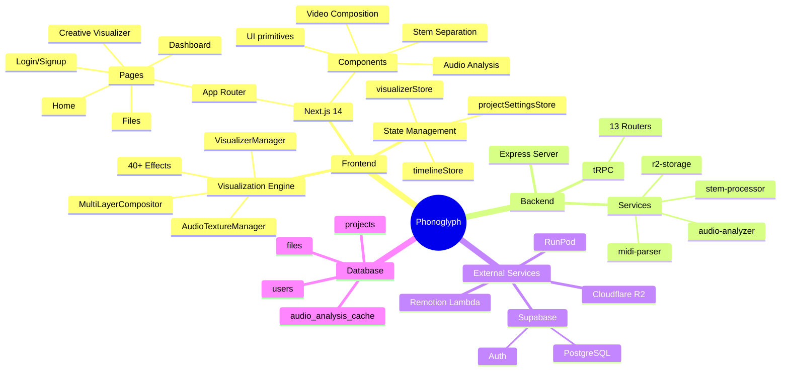
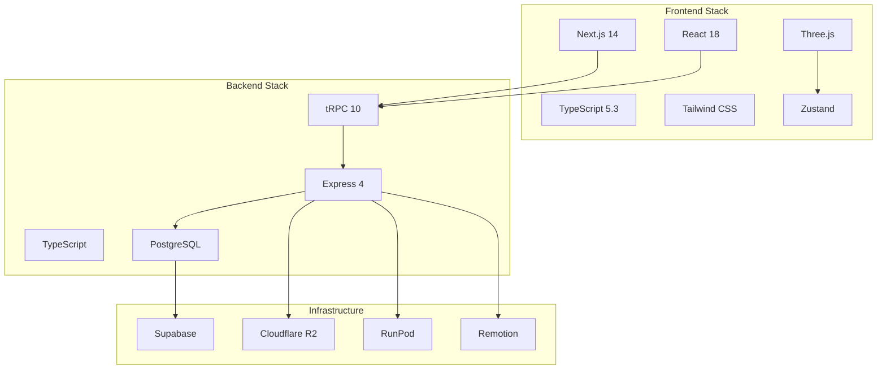

```mermaid
%%{init: {'theme': 'base', 'themeVariables': { 'primaryColor': '#1a1a2e', 'primaryTextColor': '#eee', 'primaryBorderColor': '#4a4a6a', 'lineColor': '#6a6a8a', 'secondaryColor': '#16213e', 'tertiaryColor': '#0f3460'}}}%%
flowchart TB
    subgraph Client["<b>Client Browser</b>"]
        direction TB
        NextJS["Next.js 14<br/>App Router"]
        React["React 18<br/>Components"]
        ThreeJS["Three.js<br/>WebGL Renderer"]
        Zustand["Zustand<br/>State Stores"]
        TRPC_Client["tRPC Client"]
    end

    subgraph Visualizer["<b>Visualization Engine</b>"]
        VM["VisualizerManager<br/>(Orchestrator)"]
        MC["MultiLayerCompositor<br/>(GPU Blending)"]
        ATM["AudioTextureManager<br/>(GPU Textures)"]
        Effects["40+ Shader Effects<br/>(Bloom, Glitch, etc.)"]
    end

    subgraph Stores["<b>State Management</b>"]
        VS["visualizerStore"]
        TS["timelineStore"]
        PS["projectSettingsStore"]
    end

    subgraph External_Services["<b>External Services</b>"]
        Supabase["Supabase<br/>(Auth + PostgreSQL)"]
        R2["Cloudflare R2<br/>(Object Storage)"]
        RunPod["RunPod<br/>(GPU Stem Separation)"]
        RemotionLambda["Remotion Lambda<br/>(Video Rendering)"]
    end

    subgraph Backend["<b>Backend API (Express + tRPC)</b>"]
        Express["Express Server<br/>(Port 3001)"]
        TRPC_Server["tRPC Server"]

        subgraph Routers["<b>tRPC Routers (13)</b>"]
            AuthR["auth"]
            FileR["file"]
            StemR["stem"]
            RenderR["render"]
            ProjectR["project"]
            AudioAnalysisR["audio-analysis-sandbox"]
            MIDIR["midi"]
            AssetR["asset"]
            AutoSaveR["auto-save"]
            GuestR["guest"]
            UserR["user"]
            HealthR["health"]
        end

        subgraph Services["<b>Services Layer</b>"]
            R2Svc["r2-storage"]
            AudioAn["audio-analyzer"]
            StemProc["stem-processor"]
            MediaProc["media-processor"]
            MIDIPars["midi-parser"]
            AssetMgr["asset-manager"]
        end
    end

    subgraph Database["<b>Database (PostgreSQL)</b>"]
        AuthDB["auth.users"]
        FilesDB["file_metadata"]
        ProjectsDB["projects"]
        StemsDB["stem_separation_jobs"]
        AudioCache["audio_analysis_cache"]
    end

    subgraph Remotion["<b>Remotion Export</b>"]
        RemEntry["index.ts<br/>(registerRoot)"]
        RootComp["Root.tsx<br/>(Composition Registry)"]
        RayboxComp["RayboxComposition"]
        Overlay["RemotionOverlayRenderer"]
    end

    %% Client to Visualizer connections
    NextJS --> React
    React --> ThreeJS
    React --> Stores
    ThreeJS --> VM
    VM --> MC
    VM --> ATM
    VM --> Effects
    MC --> Effects

    %% State connections
    Stores --> VS
    Stores --> TS
    Stores --> PS
    VS -.-> VM
    TS -.-> VM
    PS -.-> VM

    %% Client to Backend
    TRPC_Client --> TRPC_Server
    React --> TRPC_Client

    %% Backend structure
    Express --> TRPC_Server
    TRPC_Server --> Routers
    Routers --> Services
    Services --> R2Svc
    Services --> AudioAn
    Services --> StemProc

    %% Backend to External Services
    R2Svc --> R2
    AudioAn --> Supabase
    StemProc --> RunPod
    RenderR --> RemotionLambda

    %% Backend to Database
    Services --> Database
    AuthR --> AuthDB
    FileR --> FilesDB
    ProjectR --> ProjectsDB
    StemR --> StemsDB
    AudioAnalysisR --> AudioCache

    %% Remotion connections
    RemEntry --> RootComp
    RootComp --> RayboxComp
    RayboxComp --> Overlay
    Overlay --> VM
    VM -->|"60fps Frames"| Overlay
    RenderR --> Remotion

    %% Styling
    classDef client fill:#1a1a2e,stroke:#4a4a6a,color:#eee
    classDef engine fill:#16213e,stroke:#4a4a6a,color:#eee
    classDef backend fill:#0f3460,stroke:#4a4a6a,color:#eee
    classDef service fill:#1f4068,stroke:#4a4a6a,color:#eee
    classDef db fill:#2c2c54,stroke:#4a4a6a,color:#eee
    classDef external fill:#3d1a54,stroke:#6a4a8a,color:#eee

    class NextJS,React,ThreeJS,Zustand,TRPC_Client client
    class VM,MC,ATM,Effects engine
    class Express,TRPC_Server,Routers,Services backend
    class R2Svc,AudioAn,StemProc,MIDIPars,AssetMgr service
    class Database,AuthDB,FilesDB,ProjectsDB,StemsDB,AudioCache db
    class Supabase,R2,RunPod,RemotionLambda external
```

---

## Architecture Diagram: Phonoglyph System

---

## Data Flow Architecture

---

## Component Hierarchy

---

## Technology Stack Summary

---

*Generated from .planning/codebase documentation on 2026-02-24*
